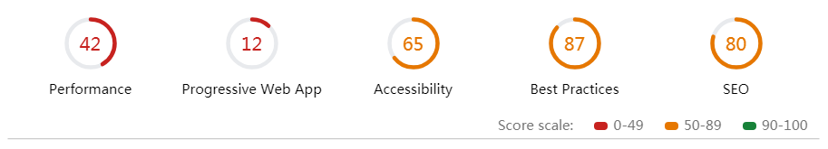

# 性能优化

## 如何分析一个项目的性能



### Performance

#### Metrics

- First Contentful Paint 第一个内容 [链接](https://developers.google.com/web/tools/lighthouse/audits/first-contentful-paint)
- First Meaningful Paint [链接](https://developers.google.com/web/tools/lighthouse/audits/first-meaningful-paint)
- Speed Index [链接](https://developers.google.com/web/tools/lighthouse/audits/speed-index)
- First CPU Idle [链接](https://developers.google.com/web/tools/lighthouse/audits/first-cpu-idle)
- Time to Interactive：可交互时间[链接](https://developers.google.com/web/tools/lighthouse/audits/consistently-interactive)
- Estimated Input Latency：预计输入延迟时间 [链接](https://developers.google.com/web/tools/lighthouse/audits/estimated-input-latency)

#### Opportunities

- Properly size images 使用正确尺寸图片[链接](https://developers.google.com/web/tools/lighthouse/audits/oversized-images)
- Defer offscreen images 使用图片懒加载加载首屏 [链接](https://developers.google.com/web/tools/lighthouse/audits/offscreen-images)
- Serve images in next-gen formats 使用 WebP JPEG 2000 JPEG XR 代替图片[链接](https://developers.google.com/web/tools/lighthouse/audits/webp)
- Preload key requests link 标签使用预加载 rel="preload" [链接](https://developers.google.com/web/tools/lighthouse/audits/preload)
- Defer unused CSS

### Progressive Web App

- Page load is not fast enough on 3G[链接](https://developers.google.com/web/tools/lighthouse/audits/fast-3g)
- Does not respond with a 200 when offline[链接](https://developers.google.com/web/tools/lighthouse/audits/http-200-when-offline)
- User will not be prompted to Install the Web App[链接](https://developers.google.com/web/tools/lighthouse/audits/install-prompt)
- Does not use HTTPS
- Does not redirect HTTP traffic to HTTPS
- Does not have a `<meta name="viewport">` tag with width or initial-scale

  - 解决方案：meta 标签修改

  ```bash
    <meta name="viewport" content="width=device-width,minimum-scale=1.0,maximum-scale=1.0" />
    修改为：
    <meta name="viewport" content="width=device-width, initial-scale=1.0" />
  ```

- Does not register a service worker
- Does not provide fallback content when JavaScript is not available[链接](https://developers.google.com/web/tools/lighthouse/audits/no-js)

  - 解决方案：index.html body 下增加如下代码:

  ```bash
    <noscript>
      <strong
        >We're sorry but my-project doesn't work properly without JavaScript
        enabled. Please enable it to continue.</strong
      >
    </noscript>
  ```

- Is not configured for a custom splash screen [链接](https://developers.google.com/web/tools/lighthouse/audits/custom-splash-screen)
- Address bar does not match brand colors[链接](https://developers.google.com/web/tools/lighthouse/audits/address-bar)

  - 解决方案：增加 meta 标签

  ```bash
    <meta name="theme-color">
  ```

- Content is not sized correctly for the viewport

### Accessibility

#### These checks highlight opportunities to improve the accessibility of your web app. Only a subset of accessibility issues can be automatically detected so manual testing is also encouraged.

#### 元素正确使用属性:Elements Use Attributes Correctly

- Image elements do not have [alt] attributes
  - ``

#### ARIA 属性遵循最佳实践:ARIA Attributes Follow Best Practices

- Elements with [role] that require specific children [role]s, are missing.[链接](https://dequeuniversity.com/rules/axe/2.2/aria-required-children?application=lighthouse)

#### 元素描述内容很好:Elements Describe Contents Well

- The page does not contain a heading, skip link, or landmark region[链接](https://dequeuniversity.com/rules/axe/2.2/bypass?application=lighthouse)
  - 无语义化标签

#### 色彩对比度令人满意：Color Contrast Is Satisfactory

- Background and foreground colors do not have a sufficient contrast ratio.[链接](https://dequeuniversity.com/rules/axe/2.2/color-contrast?application=lighthouse)

#### 页面指定有效语言：Page Specifies Valid Language

- `<html>` element does not have a [lang] attribute[链接](https://dequeuniversity.com/rules/axe/2.2/html-lang?application=lighthouse)

#### 正确使用元标记:Meta Tags Used Properly

- [user-scalable="no"] is used in the `<meta name="viewport">` element or the [maximum-scale] attribute is less than 5.[链接](https://dequeuniversity.com/rules/axe/2.2/meta-viewport?application=lighthouse)

### Best Practices

#### Does not use HTTPS

#### Does not use HTTP/2 for all of its resources

### SEO

#### 内容最佳实践:Content Best Practices

- Document does not have a meta description

#### 抓取和索引:Crawling and Indexing

- robots.txt is not valid [链接](https://developers.google.com/web/tools/lighthouse/audits/robots)

#### Mobile Friendly

- 文档不使用清晰的字体大小:Document doesn't use legible font sizes[链接](https://developers.google.com/web/tools/lighthouse/audits/font-sizes)
